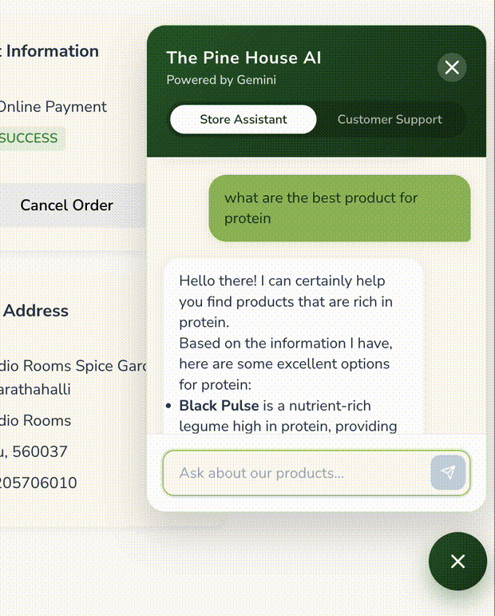
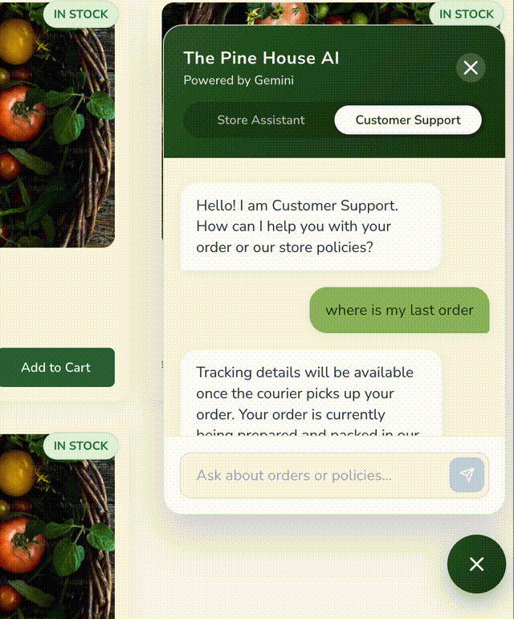

# The Pine House, a modern cloud native mini ecommerce store - Project Summary
https://hill-harvest-organics.vercel.app/

> Multi-cloud monorepo — Spring Boot on AWS Lightsail + FastAPI/LangGraph on self-managed GCP k3s — with event-driven SQS messaging, GitOps deployments via ArgoCD, and Terraform-managed infrastructure.


---

## Architecture Overview

The platform is a monorepo with four independently deployed services:

```
Hill-Harvest-Organics/
├── backend/          → Spring Boot API · AWS Lightsail · Docker
├── ai_service/       → FastAPI + LangGraph AI agent · GCP k3s · GitOps
├── frontend/         → React + TypeScript web app (learning)
├── mobile_app/       → Flutter cross-platform app (learning)
└── infrastructure/   → Terraform (GCP) · layered state management
```

**Two separate clouds, two deployment models:**
- **AWS** runs the core business backend (Lightsail, S3, SQS, SES)
- **GCP** runs the AI service on a self-managed k3s cluster with ArgoCD GitOps

---

## Backend — Spring Boot on AWS

### Tech Stack
| Layer | Technology |
|---|---|
| Runtime | Java + Spring Boot |
| Database | PostgreSQL (Supabase) + Spring Data JPA |
| Cache | Redis (rate limiting, session) |
| Auth | JWT + Spring Security + Google OAuth + OTP (SMS 2FA) |
| File Storage | AWS S3 |
| Async Messaging | AWS SQS (multiple queues) |
| Email | AWS SES |
| Payments | Razorpay (webhooks) |
| Logistics | Shiprocket (webhooks) |
| Observability | Spring Actuator + Grafana Agent + log rotation |
| Deployment | Docker + GHCR + AWS Lightsail |

### Key Domain & Services

**Notifications & Observability**
- `NotificationOrchestrator` routes events to SQS → consumers trigger AWS SES emails / SMS
- Slack alerts for order events and logistics events (separate SQS queues)
- `CartCleanupService` and `OrderCleanupService` run as scheduled jobs

**AI Integration**
- `EmbeddingService` + `EmbeddingProducer` push new product data to SQS for async embedding
- `FastApiProxyService` routes chat requests to the AI service with internal API key auth
- `ChatService` manages session context

**Rate Limiting**
- Custom `@RateLimit` annotation backed by a Redis-based `RateLimitAspect`

**Event-Driven Architecture**
- aynchronous processing of events using AWS SQS and producer consumer architecture

---

## AI Service — FastAPI + LangGraph on GCP

### Tech Stack
| Layer | Technology |
|---|---|
| Runtime | Python + FastAPI |
| Agent Framework | LangGraph + LangChain |
| LLM Providers | Groq (primary) · Google Gemini · OpenRouter (fallbacks) |
| Conversation Memory | Redis sidecar (in-pod) via `RedisChatMessageHistory` |
| Vector Store (RAG) | PostgreSQL via `PGVector` (Supabase, shared with backend) |
| Secrets | GCP Secret Manager → External Secrets Operator → K8s Secrets |
| Deployment | k3s on GCP Compute VM · ArgoCD GitOps · Kustomize |


### Architecture in the Pod
Redis runs as a sidecar (not a separate service) to keep conversation memory local to the pod without the cost of a managed Redis instance.

### Deployment (GitOps with ArgoCD) 
- ArgoCD Core (running in the cluster) detects the manifest change in and auto-syncs
---

## Infrastructure — Terraform + Kubernetes

### Terraform (GCP)

State is stored in **GCP Cloud Storage** with a layered structure:

```
infrastructure/terraform/ai_service/
├── bootstrap/  
├── foundation/   
├── workloads/    
└── modules/
    ├── gcp_compute_vm/
    ├──..
```

### Kubernetes (k3s on GCP)

**Self-managed k3s** instead of GKE to avoid ~$75/month cluster management fees.

| Component | Purpose |
|---|---|
| **k3s** | Lightweight K8s distribution, single-node |
| **Traefik** (built-in) | Ingress controller — avoids GCP Cloud Load Balancer (~$18/month) |
| **ArgoCD Core** | Lightweight GitOps controller (no UI/API server — pure sync engine) |
| **External Secrets Operator** | Syncs secrets from GCP Secret Manager into K8s Secrets (1h refresh) |
| **Kustomize** | Image tag management for GitOps deployments |

---

## Application Features

**Customer-facing**
- Browse products by category and tag
- Product detail pages with reviews and live stock status
- Cart management (guest and authenticated)
- Checkout with saved address support
- Razorpay payment integration
- Order tracking with delivery status
- AI chat assistant (product discovery, order queries)

**Admin Dashboard**
- Product and inventory management (with S3 image upload)
- Category and tag management
- Order management with status transitions
- Payment records and refund triggers
- User management
- Shipment management (Shiprocket)

**Authentication**
- Phone OTP login (guest + registered)
- Google OAuth
- JWT-based session with refresh

---

## Frontend & Mobile

> Note: React and Flutter are technologies I am actively learning. The frontend and mobile app are functional but represent my growth areas rather than production-hardened code.


The **React + TypeScript** frontend covers the full customer journey and a complete admin dashboard, bundled with Vite.  
The **Flutter** app targets iOS and Android from a single codebase.

---

## 🎥 Demo (Store Assistant)

<p align="center">
   </br>
  
</p>
