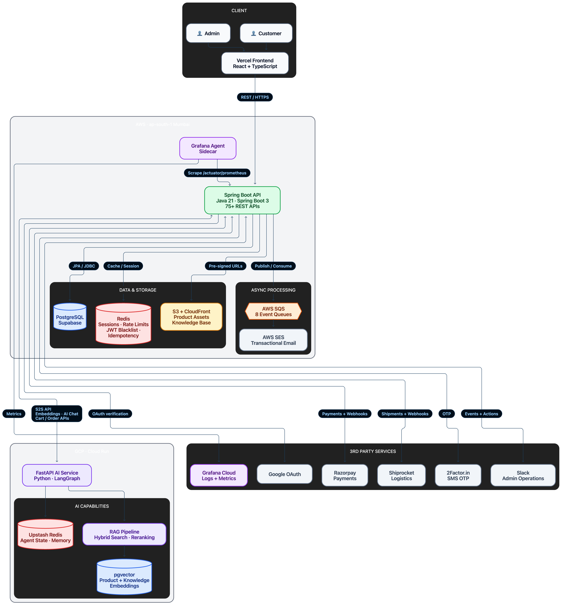
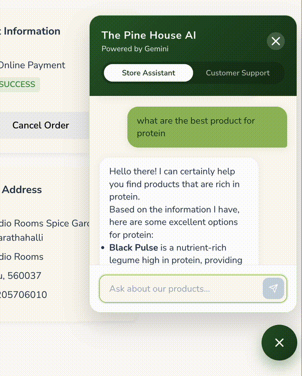
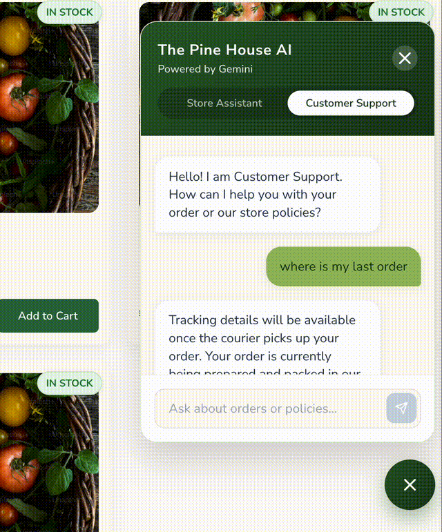
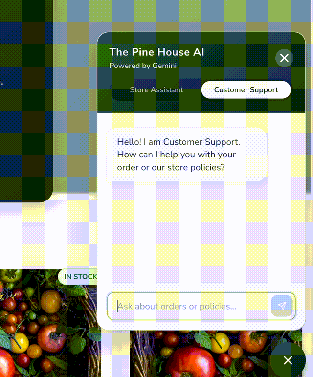

# The Pine House, a modern cloud native ecommerce store - Project Summary
https://thepinehouse.in/

> Multi-cloud monorepo — Spring Boot on AWS Lightsail + FastAPI/LangGraph on self-managed GCP cloud run — with event-driven SQS messaging, CI via GithubActions, and Terraform-managed infrastructure.


The platform handles product catalog, inventory, orders, payments, logistics, notifications, and AI-powered customer support.

## Architecture

### Backend Service


---

### AI Service


---

### Tech Stack

### Backend


### AI Service


### Cloud & Infrastructure


## Key Features

* Product catalog and inventory management
* Customer authentication with Google OAuth
* Cart and order management
* Razorpay payments and webhook processing
* Shiprocket logistics integration
* SMS and email notifications
* Slack-based admin operations
* AI-powered customer support
* RAG-based product and knowledge-base search
* Redis-based caching, sessions, rate limiting and idempotency
* Asynchronous processing using AWS SQS

## Repository Structure

```text
Hill-Harvest-Organics/
├── backend/          # Spring Boot backend
├── ai_service/       # FastAPI + LangGraph AI service
└── infrastructure/   # Terraform infrastructure
```

## Deployment

The backend runs on **AWS**, while the AI service runs independently on **GCP Cloud Run**.

Infrastructure is provisioned using Terraform and deployments are automated through GitHub Actions.

## Integrations

* Google OAuth
* Razorpay
* Shiprocket
* 2Factor.in
* Slack
* Grafana Cloud
* Google Gemini
* OpenAI
* Groq
* Jina AI


* Google OAuth
* Razorpay
* Shiprocket
* 2Factor.in
* Slack
* Grafana Cloud
* Google Gemini
* OpenAI
* Groq
* Jina AI


## 🎥 Demo (Store Assistant)

<p align="center">
  <h3> 1. Catalog suggestions</h3>
   </br>
  <h3> 2. Support agent for queries related to orders</h3>
   </br>
  <h3> 3. Retrieval from knowledge base</h3>
  
</p>
